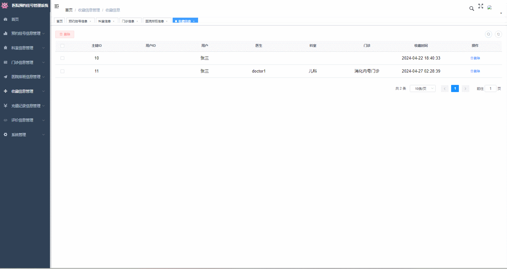
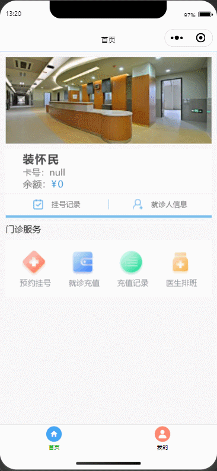

#  hospital-registe🎂

基于微信小程序的医院挂号系统（ruoyi框架）

## 介绍🌞

> 本系统分为后台管理系统和微信小程序前台两个分类，其中，后台管理系统又分为SpringBoot后端和Vue前端。后台管理系统实现了分管理员和用户双角色登录，对科室信息、挂号信息等信息进行管理，对就诊情况发表评论和用户信息的修改等功能。前台微信小程序实现了预约挂号、余额充值,显示充值记录和医生排班等信息的功能。

## 软件架构

1. 后台管理系统有用户登录功能、个人信息的增删改查、科室，门诊，医院排班，预约挂号的信息管理、黑名单和评论管理等功能。
2. 微信小程序前台则有用户登录、预约挂号、查看我的评论,金额充值等功能。

## 项目演示🌞

> 管理员





> 医生


> 小程序



## 安装教程🌞

```
1. 运行环境准备mysql8 + java8 + node14.16.1

2. 配置maven路径，加载依赖

3. 运行sql文件，确保application.yml或config.properties的数据库名称和账号密码是数据库所在主机的账号密码
```


## 使用说明🌞

```
1. 登入

    管理员账号：admin 密码：123456

    医生账号：doctor 密码：123456

    微信小程序登录会识别开发者工具的信息，但是需要在SysLoginController进行配置appid和secret
  
2. 运行流程

SpringBoot+Vue项目的部署详情可以查看这篇CSDN博客：http://t.csdnimg.cn/kpuxS

前后端不分离项目的部署流程可以查看这篇CSDN博客：http://t.csdnimg.cn/CslA5
```


## CSDN项目合集🌞

点击前往：http://t.csdnimg.cn/Q4u84


## 联系我🌞

**有偿获取完整源码或调试代码**

🐧：1902317191

微信：


